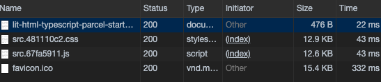

# Lit-Html Typescript Parcel Starter

[Demo](https://lit-html-typescript-parcel-starter.paulchiu.now.sh/)

Sample starter project that uses:

- [Lit-html](https://lit-html.polymer-project.org)
- [Tachyons CSS library](https://tachyons.io/)
- [Page.js client side router](https://github.com/visionmedia/page.js)
- [Typescript](https://www.typescriptlang.org/)
- [Parcel bundler](https://parceljs.org/)

The starter project builds a 2-page SPA that's approx. 27kb gzipped.

## Development

- Run `npm i` to install dependencies
- Run `npm start` to begin development

## Production Build

- Run `npm run build` to build for production
- (Optional) If you have [now](https://zeit.co/)  set up run `npm run deploy` to deploy using now

## Sources

- [Parcel Typescript recipe](https://parceljs.org/typeScript.html)
